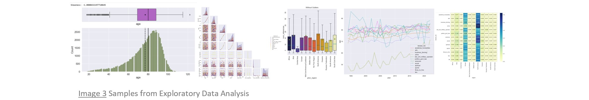
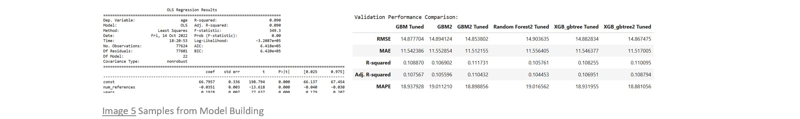

# wikipedia-life-expectancy
#### An End-to-end Supervised Machine Learning Project

## Introduction
*If a person makes the [Wikipedia Notable Deaths](https://en.wikipedia.org/wiki/Deaths_in_2022) list, is there information there that can be used to model and predict that person's life span?*[[1]](#ref1)

In addition to demonstrating of a wide range of data science [skills](#skills), I had three portfolio project criteria: (1) to scrape the data from the Web, (2) to perform extensive data cleaning (i.e., messy data), and (3) to solve a regression problem.  Enter a social-science-based exploration of life expectancy for Wikipedia Notable Deaths and we're off and running!

## Background
"[Wikipedia](https://en.wikipedia.org/wiki/Wikipedia) is a multilingual free online encyclopedia written and maintained by a community of volunteers through open collaboration and a wiki-based editing system."[[2]](#ref2)  The English-language version contains a [List of deaths by year](https://en.wikipedia.org/wiki/Lists_of_deaths_by_year) of notable individuals, with links to pages for each year, by month, from 1987 to present.[[3]](#ref3)  The current page format is consistent as far back as January, 1994, with the following Wikipedia-defined fields for each entry:
> Name, age, country of citizenship at birth, subsequent country of citizenship (if applicable), reason for notability, cause of death (if known), and reference.[[4]](#ref4)  
> 
Year, month, and day of death are also readily available, as seen in the sample in [Image 1a](#img1a), from [Wikipedia Deaths in 2022](https://en.wikipedia.org/wiki/Deaths_in_2022).[[4]](#ref4)

At the bottom of an indvidual's page (following the Name link), is a References section for that individual's page.  [Image 1b](#img1b) contains a sample from [Ramiz Abutalibov's](https://en.wikipedia.org/wiki/Ramiz_Abutalibov) page.[[5]](#ref5)
The number of references is easily scraped and can represent the individual's notability, quantified.  With this proxy for notability added, the above elements provide a framework for collecting the data.  The project overview illustrates its life cycle.[[6]](#ref6)[[7]](#ref7)

## Project Overview
### Scrape.

### Combine.

### Clean.

### Explore and analyze.

### Preprocess.

### Model.  

### Interpret.

### Predict.

  
  

## Read the Project
There are 13 Jupyter notebooks that encompass the project:
- [Notebook 1: Data Collection](https://github.com/teresahanak/wikipedia-life-expectancy/blob/main/wp_life_expect_data_collect_thanak_2022_06_10.ipynb)
- [Notebooks 2 - 9: Data Cleaning](https://github.com/teresahanak/wikipedia-life-expectancy/blob/main/wp_life_expect_data_clean1_thanak_2022_06_13.ipynb)
- [Notebook 10: Exploratory Data Analysis](https://github.com/teresahanak/wikipedia-life-expectancy/blob/main/wp_life_expect_EDA_thanak_2022_09_30.ipynb)
- [Notebook 11: Data Preprocessing](https://github.com/teresahanak/wikipedia-life-expectancy/blob/main/wp_life_expect_data_preproc_thanak_2022_10_06.ipynb)
- [Notebook 12: Linear Regression -- Interpetation Emphasis](https://github.com/teresahanak/wikipedia-life-expectancy/blob/main/wp_life_expect_olsmodel_thanak_2022_10_9.ipynb)
- [Notebook 13: Modeling for Regression -- Prediction Emphasis](http://localhost:8888/notebooks/anaconda3/envs/wikipedia-life-expectancy/wp_life_expect_models_thanak_2022_10_14.ipynb)  

Standalone contents and instructions introduce each notebook, including a data description for the dataset, in its current form, as it is loaded into the notebook.  Notebook 1 contains detailed Web-scraping instructions, including details of the PyCharm project folder and links to its contents.  **Observations** are throughout each notebook, documenting immediate context.  Exploratory Data Analysis, Linear Regression, and Modeling for Regression notebooks (10, 12, and 13) have additional "Summary", "Insights", or "Conclusion" sections at the end of their main content.

The link at the end of each notebook opens the subsequent notebook.  [Return to README](https://github.com/teresahanak/wikipedia-life-expectancy/@id=read) links are available at the top and bottom of each notebook, to return to these insructions.

## Run the Project

## Skills Demonstrated
- Coding in Python
    - PyCharm
    - Jupyter Notebooks
- Version control
    - Git
    - GitHub
    - ReviewNB
- Web scraping
    - Scrapy
- Relational database management
    - SQLite
    - [SQLite Viewer](https://inloop.github.io/sqlite-viewer/)
- Data cleaning
    - Python built-in string methods
    - regular expressions
    - pandas
- Exploratory Data Analysis
    - NumPy
    - pandas
    - Matplotlib
    - Seaborn
- Data preprocessing
    - Feature extraction
    - Transformations
- Linear regression modeling--interpretation emphasis
    - Assumptions of linear regression
    - Interpretation of coefficients
- Regressor algorithms--prediction emphasis
    - scikit-learn regressors
    - XGBoost
    - Hyperparamter tuning
    - Cross validation
- Model Performance Evaluation
    - RMSE
    - MAE
    - R2
    - Adjusted R2
    - MAPE
- Pipelines
    - Custom transformers
    - Production pipeline
- User interface for predictions

## References
