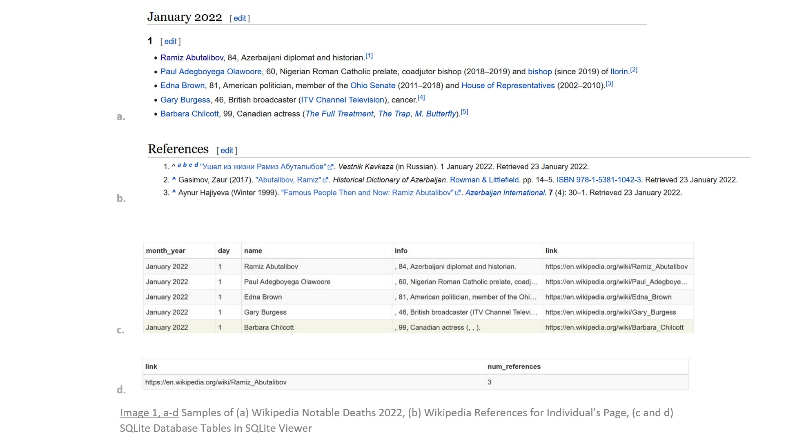
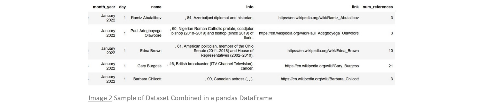
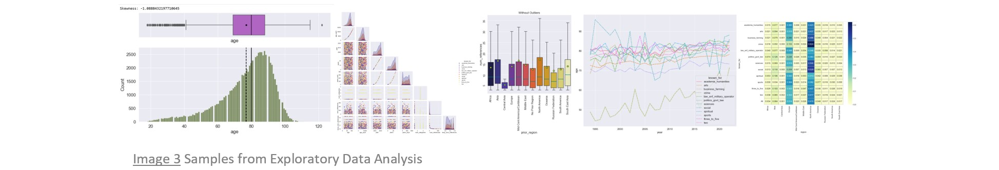
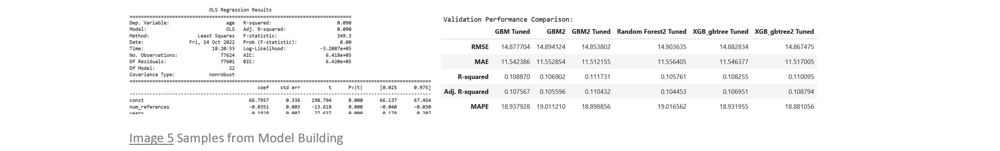
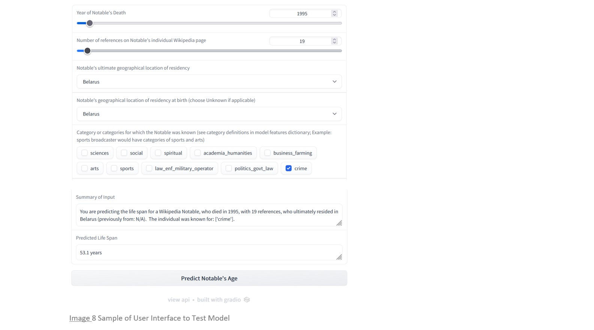
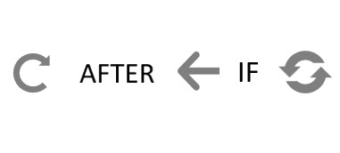

  
       
# wikipedia-life-expectancy

### An End-to-end Supervised Machine Learning Project

## Table of Contents
- [Introduction](#intro)
- [Background](#back)
- [Project Overview](#over)
- [Explore the Project](#explore)
- [Project Recap](#recap)
- [Conclusion](#conclusion)
- [Skills Demonstrated](#skills)
- [Application and Package Versions](#versions)
- [References](#refs)
- [Other Credits](#credit)
- [Contributions](#contributions)
- [Licenses](#license)
- [Appendix: Production Model Feature Dictionary](#appendix)

## Introduction
***If a person makes the [Wikipedia Notable Deaths](https://en.wikipedia.org/wiki/Deaths_in_2022) list,[1](#ref1) is there information there that can be used to model and predict that person's life span?***

In addition to demonstrating of a wide range of data science [skills](#skills), I had three portfolio project criteria: (1) to scrape the data from the Web, (2) to perform extensive data cleaning (i.e., messy data), and (3) to solve a regression problem.  Enter a social-sciences-based exploration of life expectancy for Wikipedia notables and we're off and running\ 

## Background
"[Wikipedia](https://en.wikipedia.org/wiki/Wikipedia) is a multilingual free online encyclopedia written and maintained by a community of volunteers through open collaboration and a wiki-based editing system."[3](#ref1)  The English-language version contains a [List of deaths by year](https://en.wikipedia.org/wiki/Lists_of_deaths_by_year) of notable individuals, with links to pages for each year, by month, from 1987 to present.[4](#ref1)  The current page format is consistent as far back as January, 1994, with the following Wikipedia-defined fields for each entry:
> Name, age, country of citizenship at birth, subsequent country of citizenship (if applicable), reason for notability, cause of death (if known), and reference.[5](#ref1)  
> 
Year, month, and day of death are also readily available, as seen in the sample in [Image 1a](#img1a),[6](#ref1) from [Wikipedia Deaths in 2022, January](https://en.wikipedia.org/wiki/Deaths_in_January_2022).[7](#ref1)

At the bottom of an indvidual's page (accessed by following the Name link), is a References section for that individual's page.  [Image 1b](#img1b)[8](#ref1) contains a sample from [Ramiz Abutalibov's](https://en.wikipedia.org/wiki/Ramiz_Abutalibov) page[9](#ref1).
The number of references is easily scraped and can represent the individual's notability, quantified.  With this proxy for notability added, the above elements provide a framework for collecting the data ([Image 1a-d](#img1a))[10](#ref1) and proceeding with the analysis, as outlined in the following project overview.[11](#ref1)

## Project Overview
### Scrape.

### Combine.

### Clean.

### Explore and analyze.

### Preprocess.

### Model.  

### Interpret.

### Predict.

  
  

## Explore the Project
The links below access the Jupyter Notebooks that encompass the project.  Standalone contents and install/run instructions introduce each notebook, with a description of the notebook's corresponding version of the dataset.
- [Notebook 1: Data Collection](https://github.com/teresahanak/wikipedia-life-expectancy/blob/main/wp_life_expect_data_collect_thanak_2022_06_10.ipynb)
- [Notebooks 2 - 9: Data Cleaning](https://github.com/teresahanak/wikipedia-life-expectancy/blob/main/wp_life_expect_data_clean1_thanak_2022_06_13.ipynb)
- [Notebook 10: Exploratory Data Analysis](https://github.com/teresahanak/wikipedia-life-expectancy/blob/main/wp_life_expect_EDA_thanak_2022_09_30.ipynb)
- [Notebook 11: Data Preprocessing](https://github.com/teresahanak/wikipedia-life-expectancy/blob/main/wp_life_expect_data_preproc_thanak_2022_10_06.ipynb)
- [Notebook 12: Linear Regression -- Interpretation Emphasis](https://github.com/teresahanak/wikipedia-life-expectancy/blob/main/wp_life_expect_olsmodel_thanak_2022_10_9.ipynb)
- [Notebook 13: Modeling for Regression -- Prediction Emphasis](https://github.com/teresahanak/wikipedia-life-expectancy/blob/main/wp_life_expect_models_thanak_2022_10_14.ipynb)  
- [Notebook 14: Model User Interface with Gradio](https://github.com/teresahanak/wikipedia-life-expectancy/blob/main/wp_life_expect_predict_GUI__thanak_2022_11_06.ipynb)
- [Gradio Demo hosted by 🤗 Hugging Face](https://huggingface.co/spaces/teresahanak/wikipedia-life-expectancy)

Web scraping steps are in Notebook 1, including details of the PyCharm project folder and links to its contents.

**Observations** appear throughout each notebook, documenting immediate context.  Exploratory Data Analysis, Linear Regression, and Modeling for Regression (Notebooks 10, 12, and 13) have additional **Summary**, **Key Findings**, or **Project Recap** and **Conclusion** sections at the end of their main content.  The **Project Recap** and **Conclusion** sections are also provided below.

The link at the end of the main content of each notebook opens the next notebook.  [Return to README](https://github.com/teresahanak/wikipedia-life-expectancy#explore-the-project) links are also available at the start and end of the main content of each notebook, to return to these instructions.

[References](#refs) for the entire project are below.  Individual notebooks and README have self-contained footnotes.    

  

## Project Recap
### We set out to answer the question:
>*If a person makes the [Wikipedia Notable Deaths](https://en.wikipedia.org/wiki/Deaths_in_2022) list,[12](#ref1) is there information there that can be used to model and predict that person's life span?*
>
As intended, the journey took us through the processes of Web scraping, cleaning (*very*) messy data, and solving a regression problem.

### Along the way, we made key decisions as to which path to take:

- During **data collection**, the number of references for each individual's Wikipedia page was collected as a proxy for notability.  This feature, `num_references`, has the 4th highest importance of predictors in the champion model. 
- Nearing completion of the first attempt, extracting `known for` information (the most challenging and lengthy phase of both **data cleaning** and the project overall) was completely rebooted.  It was at that point that the current standardized version of its code was realized.  The difficult but worthwhile decision was made to redo that step with the better code.  
- The inclusion criterion of having at least 3 references was also decided during **data cleaning**, at the cost of reducing the size of the dataset, but with the benefit of increased focus on more notable individuals.  The decision came with the secondary benefit of reducing the extraction time for the `known for` categories.
- Delineating the `known for` categories, also part of **data cleaning**, was its own challenge and potential source of bias and noise.  The programatically-driven manual approach to extracting this information was beneficial over a purely manual approach, in that prior iterations on earlier searched columns could be easily referenced or updated for consistency and accuracy.
- Additional inclusion criteria were added at the start of **EDA**, to focus the study on notability for proactive living, rather than for passive association with events or characteristics.  They included minimum attained age of 18 and being `known for` at least one category other than `event_record_other`--an inherently noisy class that accounts for individuals known for extreme age, physical characteristics, association with or being the victim of an event, etc.  To follow suit for the remaining entries, the `event_record_other` category was then dropped, altogether.
- Also during **EDA**, a new `known_for` feature was engineered by combining `known for` categories into a single column, with 2 new classes for entries with multiple categories ("two" and "three_to_five").  The original columns would have been problematic for linear regression interpretation, due to some individuals having multiple categories.
- For emphasis on **interpretability**, a **linear regression model** was built, though the assumption of normally distributed residuals was sacrificed for ease of coefficient interpretation.  
- For better **prediction**, **model building with various ensemble regressors with hyperparameter tuning** was performed.  Before choosing the champion model, separate iterations of model building were conducted: (1) with the engineered combined `known_for` feature, and (2) with the original `known for` categories plus `num_categories` (number of `known for` categories for and individual).

### What did we find?
We analyzed a dataset of ~78,000 entries of notable indviduals scraped from [Wikipedia Notable Deaths](https://en.wikipedia.org/wiki/Deaths_in_January_1994) for January, 1, 1994, through June 9, 2022,[13](#ref1) with the goal of ascertaining if the information there was sufficient to model a notable individual's life span.  An additional ~19,400 entries were maintained separately for testing.  Highlights include observed characteristics of the dataset, interpretation of key predictive features, and model performance.
#### Observed Characteristics of the Dataset
- Life span ranges from 18 to 122, averaging ~77 years.  
- The  number of references ranges from 3 to 660, with at least 75% of entries have 13 or fewer references. 
- Of the 11 residency regions, North America is the top value, followed by Europe, accounting for \~73% of entries combined.
- Over 94% of entries have a single region of residency.  The most relocations came from European countries (\~3% of entries).
- The vast majority (\~86%) of entries have a single known for category, but there are entries with as many as 5 categories.
- Just over 1/3 of entries are known for arts, followed by sports, then politics_govt_law, which combined also make up just over 1/3 of entries. 

#### Interpretation of Key Predictors from EDA, Linear Regression *olsmodel3*, and Champion Model *GBM2_tuned*
- *Notoriety does not beget longevity.*
    - Notables in the crime category have the shortest average life span, of ~55 years.
    - In *olsmodel3*, being known for crime is associated with a 23.5-year decrease in age.* 
    - In the the champion model, *GBM2_tuned*, (known for) crime is the 2nd most important predictive feature.
- *When it comes to life span, more publicity is not better.*
    - In *olsmodel3*, a 10 unit increase in number of references is associated with a 0.4-year decrease in age.*  The finding may reflect well-known convicted criminals (i.e., with shorter life spans) and the unexpected deaths of other famous younger individuals drawing more attention, keeping in mind that association does not imply causation.  In contrast, longer living individuals have more time to make their mark, but that possibility does not offset the other underlying contributing factors associating decreased life span with increased notability.
    - In the champion model, *GBM2_tuned*, number of references is the 4th most important predictive feature.
- *Mind vs Body Connection?*
    - Notables in the sports category have the second shortest average life span, of ~72 years, while those in spiritual and sciences categories have the highest, of ~82 years.
    - In *olsmodel3*, being known for sports  is associated with a 7-year decrease in age, while being known for spiritual living or sciences is associated with a 3.5-year or 3-year increase in age, respectively.*
    - In the champion model, *GBM2_tuned*, sports is the most important predictive feature.  Sciences and spiritual are 9th and 14th, respectively.
- *Time will tell.*
    - There is an overall upward trend in mean age with the advancement of year of death.  The net increase in mean life span is ~5 years, from ~74 to ~79 years, from January, 1994, to June, 2022.
    - In *olsmodel3*, a unit increase in years (i.e., year of death) is associated with a 0.2-year increase in age--a finding consistent with the expectation of overall increasing human life expectancy.*
    - In the champion model, *GBM2_tuned*, years (i.e., year of death) is the 3rd most important predictive feature.
- *Location, location, location.*
    - Individuals of the Central Asia region have the shortest average life span (\~67 years), followed by Africa (\~69 years), while those of Europe and North America have the longest (\~78 years).
    - In *olsmodel3*, being of region Europe OR North America OR Asia is associated with a nearly 10-year increase in age.*
    - In the champion model, *GBM2_tuned*, regions North America and Europe are the 5th and 6th most important predictive features, respectively.  
    
#### Champion Model and Performance
- The champion model, *GBM2_tuned*, is able to account for ~11.2% of the variation in life span of Wikipedia notables who meet inclusion criteria.  
- The productionized model is able to predict life span of said individuals within an average error of ~11.5 years or ~18.7%.
- Combined, the more robust ensemble algorithm, inclusion of the original `known for` category and `num_categories` predictors, and hyperparameter tuning resulted in an increase of 2.4% in explained variation in life span by the champion model, *GBM2_tuned*, over the linear regression model, *olsmodel3*.
    ___________________________
    \*All else constant and compared to reference level for categorical features:  
    - region: Africa OR Central Asia  
    - known_for: academia_humanities, politics_govt_law, business_farming, OR social  
        

        
## Conclusion
    
#### *Is there information in the [Wikipedia Notable Deaths](https://en.wikipedia.org/wiki/Deaths_in_2022) list with which to model a notable's life span?*[14](#ref1)
- There is scant predictive information, but not nothing.  

- Compared to the suggested benchmark of $R^2$ > 0.35 for machine learning models in the social sciences,[15](#ref1) the champion model is not a very good predictor.  However, given the very narrow breadth of included predictors (region, prior region (if any), number of references (a proxy for notability), year of death, and the domain(s) for which the individual was known), explaining 11.2% of the variation in life span is reasonable.

- Other potentially predictive features such as gender, marital status, income, education level, ethnicity, etc., are not overtly present in the model.  It is feasible that the addition of some other key predictors to the current model's predictors (i.e., not in lieu of them) could close the gap between the model's performance and the domain's benchmark minimum $R^2$ for performance.[16](#ref1)

#### *Follow-up Opportunities:*
- Cause of death was collected but not examined in this project.  COVID-19, suicide, and cancer (many types) stood out anecdotally.  Comparisons of rates, both in-sample (e.g., with regard to `known for` category) and in relation to those of the general population, are potential areas of further study.

- Delineation of `known for` categories is a likely source of bias.  For example, in the current version of the dataset, a person who was known for activism related to an illness, who died at an early age from that illness, is included in either the politics_govt_law or social category (dependent on how their activism manifested).  In many cases, the individual became an activist as a result of the diagnosis.  In a sense there is a combined passive situation with resultant proactive behavior, for which the person was then known.  The problem for analysis lies in the possibility that the individual is known for activity directly tied to a shortened life span.  Another approach would be to add a `known for` category for such activism.

- A source of noise is whether or not military service is captured by the law_enf_military_operator category.  In particular, males of the World War II generation were very likely to have served.  For those notables who were known specifically for their military service, the category is captured.  For the others, it is hit or miss.  In some instances, the category was captured secondary to a manual check of an individual's page for another reason.  Finding the information within an individual's page is a much more complicated programmatic challenge than scraping the listed information, as we have done here.

______________________
1. "Deaths in 2022," Wikipedia, last modified October 24, 2022, https://en.wikipedia.org/wiki/Deaths_in_2022.
2. "Lists of deaths by year," Wikipedia, last modified October 1, 2022, https://en.wikipedia.org/wiki/Lists_of_deaths_by_year.
3. "Wikipedia," Wikipedia, last modified October 20, 2022, https://en.wikipedia.org/wiki/Wikipedia.
4. See note 2 above.
5. See note 1 above.
6. "File:Wikipedia Deaths Jan 2022 snippet.png," Wikimedia Commons, last modified October 23, 2022, https://commons.wikimedia.org/wiki/File:Wikipedia_Deaths_Jan_2022_snippet.png.
7. "Deaths in January 2022," Wikipedia, last modified October 24, 2022, https://en.wikipedia.org/wiki/Deaths_in_January_2022.
8. "File:Screenshot snippet of Wikipedia Ramiz Abutalibov References.png," Wikimedia Commons, last modified October 23, 2022, https://commons.wikimedia.org/wiki/File:Screenshot_snippet_of_Wikipedia_Ramiz_Abutalibov_References.png.
9. "Ramiz Abutalibov," Wikipedia, last modified May 14, 2022, 2022, https://en.wikipedia.org/wiki/Ramiz_Abutalibov.
10. "File:Wikipedia Deaths Jan 2022 snippet.png," Wikimedia Commons, last modified October 23, 2022, https://commons.wikimedia.org/wiki/File:Wikipedia_Deaths_Jan_2022_snippet.png; "File:Screenshot snippet of Wikipedia Ramiz Abutalibov References.png," Wikimedia Commons, last modified October 23, 2022, https://commons.wikimedia.org/wiki/File:Screenshot_snippet_of_Wikipedia_Ramiz_Abutalibov_References.png; "Deaths in January 1994" through "Deaths in June 2022" (through June 9, 2022) and each listed individual's page, Wikipedia, accessed (scraped) June 9-10, 2022, https://en.wikipedia.org/wiki/Deaths_in_January_1994.
11. "Deaths in January 1994" through "Deaths in June 2022" (through June 9, 2022) and each listed individual's page, Wikipedia, accessed (scraped) June 9-10, 2022, https://en.wikipedia.org/wiki/Deaths_in_January_1994; "A List of Nationalities," WorldAtlas, Victor Kiprop, last modified May 14, 2018, https://www.worldatlas.com/articles/what-is-a-demonym-a-list-of-nationalities.html.; Marijn Huizendveld, List of nationalities. (GitHub, accessed June 17, 2022), https://gist.github.com/marijn/274449#file-nationalities-txt; "Map of the World's Continents and Regions," Nations Online Project, accessed June 29, 2022, https://www.nationsonline.org/oneworld/small_continents_map.htm; Abubakar Abid, Ali Abdalla, Ali Abid, Dawood Khan, Abdulrahman Alfozan, James Zou, "Gradio: Hassle-Free Sharing and Testing of ML Models in the Wild," arXiv preprint arXiv:1906.02569, June 6, 2019, https://arxiv.org/abs/1906.02569.
12. See note 1 above.
13. See note 11 above.
14. See note 1 above.
15. "Linear Correlation," DePaul University, accessed November 1, 2022, https://condor.depaul.edu/sjost/it223/documents/correlation.htm.
16. See note 15 above.

## Skills Demonstrated
- Virtual Environments
  - Anaconda Navigator
- Coding and Documentation
    - Python
    - PyCharm
    - Jupyter Notebook
    - Markdown
    - HTML
    - LaTeX
- Version Control
    - Git
    - GitHub
    - [ReviewNB](https://www.reviewnb.com/) (tool used without reproduction)
- Web scraping
    - Scrapy
- Relational Database Management
    - SQLite
    - [SQLite Viewer](https://inloop.github.io/sqlite-viewer/) (tool used without reproduction)
- Data Cleaning
    - Python Built-in String Methods
    - regular expressions
    - pandas
- Exploratory Data Analysis
    - NumPy
    - pandas
    - Matplotlib
    - Seaborn
- Data Preprocessing
    - Feature Engineering
    - Transformations
- Linear Regression Modeling--Interpretation Emphasis
    - Assumptions
    - Coefficient Interpretation
- Regressor Algorithms--Prediction Emphasis
    - scikit-learn Regressors
    - XGBoost
    - Hyperparamter Tuning
    - Cross validation
- Model Performance Evaluation
    - RMSE
    - MAE
    - $R^2$
    - Adjusted $R^2$
    - MAPE
- Pipelines
    - Custom Transformers
    - Production Pipeline
- Model Testing with User Interface
  - [Gradio](https://gradio.app/)
  - [Hugging Face](https://huggingface.co/)

## Application and Package Versions
- [Anaconda Navigator](https://docs.anaconda.com/navigator/index.html) 2.2.0 virtual environment
- [chime 0.5.3](https://pypi.org/project/chime/)
- [Gradio](https://gradio.app/)
- [Jupyter Notebook](https://jupyter.org/) 6.4.8
- [Matplotlib](https://matplotlib.org/) 3.5.1
- [nb_black](https://pypi.org/project/nb-black/)
- [NumPy](https://numpy.org/) 1.223
- [pandas](https://pandas.pydata.org/) 1.4.2
- [pip](https://pypi.org/project/pip/) 21.2.4
- [Protego](https://github.com/scrapy/protego) 0.2.1
- [PyCharm](https://www.jetbrains.com/pycharm/) Professional 2021.1.2
- [PyLab](https://scipy.github.io/old-wiki/pages/PyLab)
- [Python](https://www.python.org/) 3.9.12
- [ReviewNB](https://www.reviewnb.com/) (tool used without reproduction)
- [scikit-learn](https://scikit-learn.org/stable/) 1.0.2
- [SciPy](https://scipy.org/) 1.7.3
- [Scrapy](https://scrapy.org/) 2.6.1
- [seaborn](https://seaborn.pydata.org/) 0.11.2
- [SQLite](https://www.sqlite.org/index.html) 3.38.3
- [SQLite Viewer](https://inloop.github.io/sqlite-viewer/) (tool used without reproduction)
- [statsmodels](https://www.statsmodels.org/stable/index.html) 0.13.2
- [XGBoost](https://xgboost.readthedocs.io/en/stable/) 1.6.1

## References
Abid, Abubakar and Abdalla, Ali and Abid, Ali and Khan, Dawood and Alfozan, Abdulrahman and Zou, James.  "Gradio: Hassle-Free Sharing and Testing of ML Models in the Wild."  arXiv preprint arXiv:1906.02569. June 6, 2019.  https://arxiv.org/abs/1906.02569.

Andrade, Frank. "Python Scrapy for Beginners — A Complete Web Scraping Project [Web Scraping with Python]." 2021 YouTube video, 34:17. Posted by Frank Andrade. November 9, 2021. https://www.youtube.com/watch?v=ooNngLWhTC4.

Andrade, Frank. "Web Scraping in Python BeautifulSoup, Selenium & Scrapy 2022 (Scrapy modules)." 2022 Udemy course, 98 minutes (Scrapy modules). Posted by Frank Andrade. Last modified June, 2022. https://www.udemy.com/course/web-scraping-course-in-python-bs4-selenium-and-scrapy/.

DePaul University. "Linear Correlation." Accessed November 1, 2022, https://condor.depaul.edu/sjost/it223/documents/correlation.htm.

Huizendveld, Marjin. *List of nationalities*. GitHub. Accessed June 17, 2022. https://gist.github.com/marijn/274449#file-nationalities-txt.

Kiprop, Victor. "A List of Nationalities." WorldAtlas. Last modified May 14, 2018. https://www.worldatlas.com/articles/what-is-a-demonym-a-list-of-nationalities.html.

Krishna and Ethan. "How to download a Jupyter Notebook from GitHub?" *Stack Exchange, Data Science* (blog).  Last modified 21 September 2021. 
https://datascience.stackexchange.com/questions/35555/how-to-download-a-jupyter-notebook-from-GitHub.

Lewinson, Eryk. "Coding a custom imputer in scikit-learn." Towards Data Science. May 21, 2020. https://towardsdatascience.com/coding-a-custom-imputer-in-scikit-learn-31bd68e541de.

Nations Online Project. "Map of the World's Continents and Regions."  Accessed June 29, 2022, https://www.nationsonline.org/oneworld/small_continents_map.htm.

Wikimedia Commons. "File:Screenshot snippet of Wikipedia Ramiz Abutalibov References.png." Last modified October 23, 2022. https://commons.wikimedia.org/wiki/File:Screenshot_snippet_of_Wikipedia_Ramiz_Abutalibov_References.png.

Wikimedia Commons. "File:Wikipedia Deaths Jan 2022 snippet.png." Last modified October 23,2022. https://commons.wikimedia.org/wiki/File:Wikipedia_Deaths_Jan_2022_snippet.png.

Wikipedia. "Deaths in 2022." Last modified October 24, 2022. https://en.wikipedia.org/wiki/Deaths_in_2022. 

Wikipedia. "Deaths in January 1994" through "Deaths in June 2022" (through June 9, 2022) and each listed individual's page. Accessed (scraped) June 9-10, 2022, https://en.wikipedia.org/wiki/Deaths_in_January_1994.

Wikipedia. "Deaths in January 2022."  Last modified October 24, 2022. https://en.wikipedia.org/wiki/Deaths_in_January_2022.

Wikipedia. "Lists of deaths by year." Last modified October 1, 2022. https://en.wikipedia.org/wiki/Lists_of_deaths_by_year.

Wikipedia. "Ramiz Abutalibov."  Last modified May 14, 2022. https://en.wikipedia.org/wiki/Ramiz_Abutalibov.

Wikipedia. "Sudhakar Chaturvedi." Last modified October, 24, 2022.  https://en.wikipedia.org/wiki/Sudhakar_Chaturvedi.

Wikipedia. "Wikipedia." Last modified October 20, 2022. https://en.wikipedia.org/wiki/Wikipedia.

## Other Credits
The **overall approach** to coding in Python, analysis and modeling, and a majority of the plots (Notebooks 10, 11, 12, and 13, and Project Overview images above) are adapted from examples learned in [The University of Texas McCombs School of Business Post Graduate Program in Data Science and Business Analytics in partnership with Great Learning](https://www.mygreatlearning.com/ut-austin-data-science-business-analytics-program?&utm_source=google&utm_medium=search&utm_campaign=BA_Int_Search_Brand_Broad_US&adgroup_id=124131117771&campaign_id=12451747881&Keyword=ut%20austin%20data%20science&placement=&gclid=Cj0KCQjwteOaBhDuARIsADBqRegPrwBrU9zW94FIAU9pNhR1pKb_iM1R52yPuee33gKlc6Aa4O-YzmYaAhoKEALw_wcB).

**Git and GitHub** implementation was acquired from Anna Skoulikari, through the Udemy course, [Git Learning Journey - Guide to Learn Git (Version Control)](https://www.udemy.com/share/102FUK3@gXOY8-8NIGjJAqOsTNhyO2n7DZU_PXlQaXytDb055i6wsiLN0PYjXXLc5CgsBGWE/).

Review of **Jupyter Notebooks** for pull requests **on GitHub** was entirely dependent on [ReviewNB](https://www.reviewnb.com/), following Amit Rathi's instructions in the Towards Data Science article, ["How to use Git / GitHub with Jupyter Notebook"](https://towardsdatascience.com/how-to-use-git-github-with-jupyter-notebook-7144d6577b44).

**Web scraping with Scrapy** was learned from Frank Andrade, through the Udemy course, [Web Scraping in Python BeautifulSoup, Selenium & Scrapy 2022](https://www.udemy.com/share/1050RC3@OPQBrWla1wb5dcRcMS85QPUjfv5L0Oh_D2zoekwqDPKrFKWCzRD1NlqRzdEWUzNo/).

Though not extensively used in this project, **SQL** implementation was acquired from Jose Portilla, through the Udemy course, [The Complete SQL Bootcamp 2022: Go from Zero to Hero](https://www.udemy.com/share/101Whk3@9gWCE0SdPuKlezaUcy_GNhWrQ8ZkhLvMl7_AjRoovgr6p8O6dJVtd5TGmF4OKBWb/).

**Custom imputer** coding steps are from Eryk Lewinson's Towards Data Science article, ["Coding a custom imputer in scikit-learn"](https://towardsdatascience.com/coding-a-custom-imputer-in-scikit-learn-31bd68e541de), with the addition of a strategy for mode.

The instructions for [Gradio Blocks](https://gradio.app/quickstart/#blocks-more-flexibility-and-control) were a starting point for the **Gradio demo**, combined with following the class documentation (i.e., <kbd>Shift</kbd> + <kbd>Tab</kbd>).  To have the Gradio demo permanently hosted on **Hugging Face Spaces**, [these instructions to drag and drop files](https://gradio.app/sharing_your_app/#hosting-on-hf-spaces) were followed.  The files are accessible in [Files and versions](https://huggingface.co/spaces/teresahanak/wikipedia-life-expectancy/tree/main) on the space.  Note that the [requirements.txt](https://huggingface.co/spaces/teresahanak/wikipedia-life-expectancy/blob/main/requirements.txt) file was necessary for the app to successfully build on the Hugging Face Space.  The [app.py](https://huggingface.co/spaces/teresahanak/wikipedia-life-expectancy/blob/main/app.py) file is a copy and paste of Notebook 14 code, directly into the browser as prompted when creating the space.  

**Thank you** to all of the Wikipedians and Wikipedia Notables whose respective contributions and fascinating lives lived made this exploration possible.

## Contributions
This project serves as an end-to-end portfolio project for its author, as sole contributor.

## [Licenses](https://github.com/teresahanak/wikipedia-life-expectancy/blob/main/Licenses.txt)
#### Text and Wikipedia Data (excludes images and scraped and downloaded data for nationality/country/demonyms--see original sources):
wikipedia-life-expectancy (Text and Data) © 2022 by Teresa Hanak is licensed under CC BY-SA 4.0 

#### Code (excludes data and plots):
wikipedia-life-expectancy (Code) released under MIT License  
Copyright 2022 Teresa Hanak

## Apppendix: Production Model Feature Dictionary
- **num_references**:  Number of references for individual's page
- **years**: Translation of year pf death (year - 1994)
- **sciences**: (0 for no or 1 for yes) individual known for sciences (math, physics, chemistry, engineering, mechanics, etc.)
- **social**: (0 for no or 1 for yes) individual known for social action (philanthropy, fund-raising for social cause, founder of charity, etc.)
- **spiritual**: (0 for no or 1 for yes) individual known for spiritual association (religious association, traditional healing, self-help/motivational instructor, etc.)
- **academia_humanities**: (0 for no or 1 for yes) individual known for education activity (educator, education administration, lecturer, etc.; excludes sports-related instruction/coaching, but includes art/performing arts instruction; includes museum-related activities; classics, archeology, linguistics, anthropology, etc.)
- **business_farming**: (0 for no or 1 for yes) individual known for business or farming (includes marketing, millionaire/billionaire, manufacturing, oil/energy)
- **arts**: (0 for no or 1 for yes) individual known for arts-related activity (fine and performing arts, journalism, writing, arts administration, art patronage, collecting, etc.; gallery owners/founders are included; museum-related is excluded; stunt performers included)
- **sports**: (0 for no or 1 for yes) individual known for sports-related activity (traditional sports participation/instruction/coaching/ownership/fandom/commentator and anything competition-based, including non-physical games, such as chess; sportswriter, etc. would have dual category of arts)
- **law_enf_military_operator**: (0 for no or 1 for yes) individual known for law enforcement, military/paramilitary association/activity, or specialized equipment operation (pilot, ship captain (non-sport), radio operator, etc.); category aims to reflect individual's proximity to activity and/or weapons/equipment or decision-making that could impact life span, independent of legality of activity
- **politics_govt_law**: (0 for no or 1 for yes) individual known for political activity (official or activism), participation in legal system (lawyer, judge, etc.), nobility or inherited status; directly or by marriage; union activity is included
- **crime**: (0 for no or 1 for yes) individual known for criminal activity; category aims for "innocent until proven guilty"; includes convicted criminals (can be for a different crime); includes individuals labeled "terrorist", but generally excludes individuals awaiting trial
- **num_categories**: Total number of known for categories for individual
- **region_**: One hot encoded (0 for no or 1 for yes) ultimate geographical region of residency as follows:
    - **region_Asia**
    - **region_Central Asia**
    - **region_Europe**
    - **region_Mid-Cent America/Caribbean**
    - **region_Middle East**
    - **region_North America**
    - **region_Oceania**
    - **region_Russian Federation**
    - **region_South America**
    - **region_South East Asia**
- **prior_region_**: One hot encoded (0 for no or 1 for yes) prior geographical region of residency, with option of "No Prior Region", as follows:
    - **prior_region_Asia**
    - **prior_region_Central Asia**
    - **prior_region_Europe**
    - **prior_region_Mid-Cent America/Caribbean**
    - **prior_region_Middle East**
    - **prior_region_No Prior Region**
    - **prior_region_North America**
    - **prior_region_Oceania**
    - **prior_region_Russian Federation**
    - **prior_region_South America**
    - **prior_region_South East Asia**
