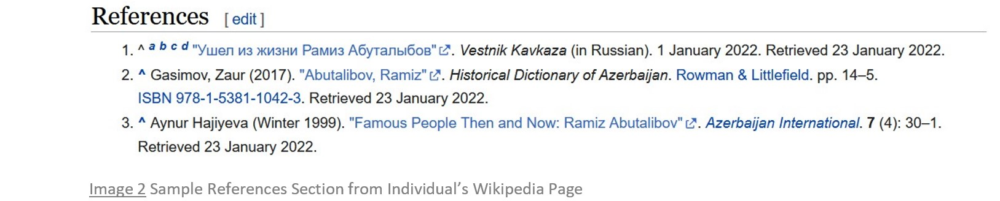
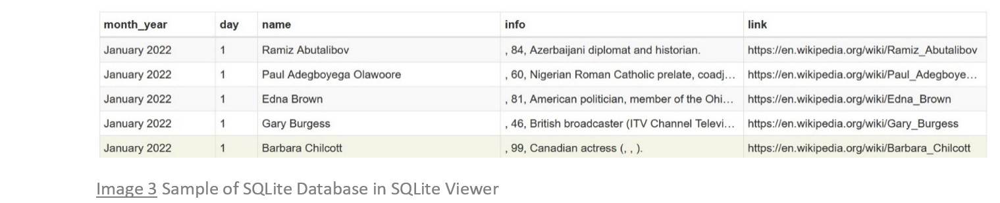

# wikipedia-life-expectancy
#### An End-to-end Supervised Machine Learning Project

## Introduction
*If a person makes the [Wikipedia Notable Deaths](https://en.wikipedia.org/wiki/Deaths_in_2022) list, is there information there that can be used to model and predict that person's life span?*[[1]](#ref1)

The above problem question answers its predecessor: "What should I do for a portfolio project?"  In addition to allowing the demonstration of a wide range of data science [skills](#skills), I had three
 portfolio project criteria: (1) to scrape the data from the Web, (2) to perform extensive data cleaning (i.e., messy data), and (3) to solve a regression problem.  Enter Wikipedia Notable Deaths and we're off!

## Background
"[Wikipedia](https://en.wikipedia.org/wiki/Wikipedia) is a multilingual free online encyclopedia written and maintained by a community of volunteers through open collaboration and a wiki-based editing system."[[2]](#ref2)  The English-language version contains a [List of deaths by year](https://en.wikipedia.org/wiki/Lists_of_deaths_by_year) of notable individuals, with links to pages for each year, by month, from 1987 to present.[[3]](#ref3)  The current page format is consistent as far back as January, 1994, with the following scrapable, Wikipedia-defined fields for each entry:
> Name, age, country of citizenship at birth, subsequent country of citizenship (if applicable), reason for notability, cause of death (if known), and reference.[[4]](#ref4)  
> 
[Image 1](#img1), a sample from [Wikipedia Deaths in 2022](https://en.wikipedia.org/wiki/Deaths_in_2022), January, illustrating individuals are .[[4]](#ref4)
.

At the bottom of an indvidual's page (after following the Name link), there is a References section for that individual's page.  [Image 2](#img2) contains a sample from [Ramiz Abutalibov's](https://en.wikipedia.org/wiki/Ramiz_Abutalibov) page.[[5]](#ref5)
The number of references is easily scrapable and can represent the individual's notability, quantified.  With this proxy for notability added, the above list provides a framework for collecting the data.  
  
Images 1-6 illustrate the lifecyle of the data.
## Dataset Lifecycle
### Start here

  
### and here.

### Scrape to here

### and here.

### Combine here.

### Clean, clean, clean, clean, clean... and clean some more, then preprocess.

## Table of Contents

#### Skills Demonstrated
- Coding in Python
    - PyCharm
    - Jupyter Notebooks
- Version control
    - Git
    - GitHub
    - ReviewNB
- Web scraping
    - Scrapy
- Relational database management
    - SQLite
    - [SQLite Viewer](https://inloop.github.io/sqlite-viewer/)
- Data cleaning
    - Python built-in string methods
    - regular expressions
    - pandas
- Exploratory Data Analysis
    - NumPy
    - pandas
    - Matplotlib
    - Seaborn
- Data preprocessing
    - Feature extraction
    - Transformations
- Linear Regression Modeling for Interpretation
    - Assumptions of Linear Regression
- Modeling Algorithms for Prediction
    - scikit-learn regressors
    - XGBoost
    - Hyperparamter Tuning
    - Cross Validation
- Model Performance Evaluation
    - RMSE
    - MAE
    - R2
    - Adjusted R2
    - MAPE
- Pipelines
    - Custom transformers
    - Production pipeline
- User interface for predictions

## Data Dictionary
Variable: Description

## References
