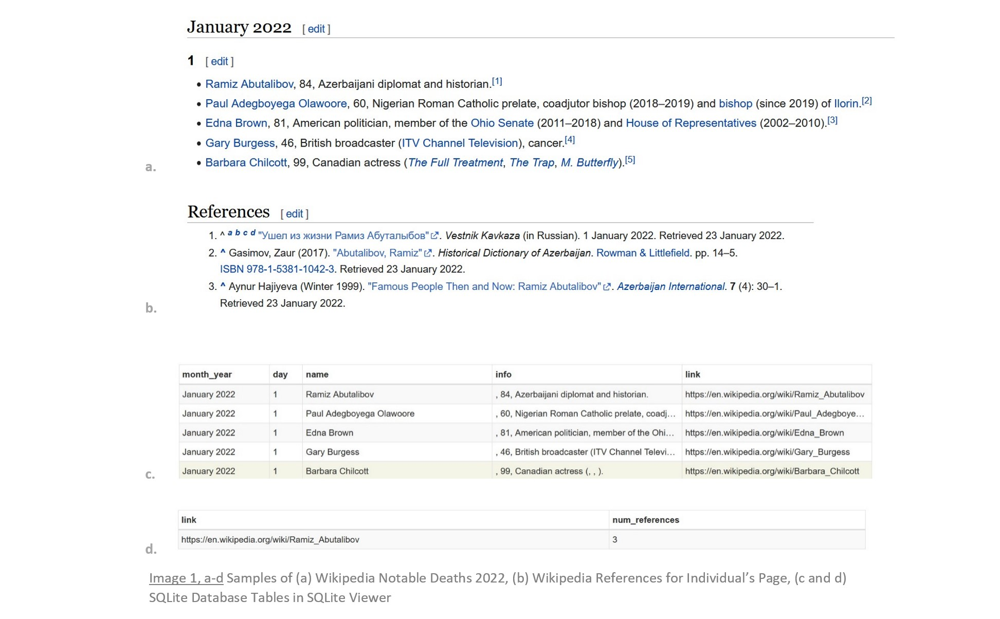

# wikipedia-life-expectancy
#### An End-to-end Supervised Machine Learning Project

## Introduction
*If a person makes the [Wikipedia Notable Deaths](https://en.wikipedia.org/wiki/Deaths_in_2022) list, is there information there that can be used to model and predict that person's life span?*[[1]](https://en.wikipedia.org/wiki/Deaths_in_2022)

The above problem question answers its predecessor: "What should I do for a portfolio project?"  In addition to allowing the demonstration of a wide range of data science [skills](#skills), I had three
 portfolio project criteria: (1) to scrape the data from the Web, (2) to perform extensive data cleaning (i.e., messy data), and (3) to solve a regression problem.  Enter Wikipedia Notable Deaths and we're off!

## Background
"[Wikipedia](https://en.wikipedia.org/wiki/Wikipedia) is a multilingual free online encyclopedia written and maintained by a community of volunteers through open collaboration and a wiki-based editing system."[[2]](https://en.wikipedia.org/wiki/Wikipedia)  It contains a [List of deaths by year](https://en.wikipedia.org/wiki/Lists_of_deaths_by_year) of notable individuals.[[3]](https://en.wikipedia.org/wiki/Lists_of_deaths_by_year)

## Table of Contents

#### Skills Demonstrated
- Coding in Python
    - PyCharm
    - Jupyter Notebooks
- Version control
    - Git
    - GitHub
    - ReviewNB
- Web scraping
    - Scrapy
- Relational database management
    - SQLite
    - [SQLite Viewer](https://inloop.github.io/sqlite-viewer/)
- Data cleaning
    - Python built-in string methods
    - regular expressions
    - pandas
- Exploratory Data Analysis
    - NumPy
    - pandas
    - Matplotlib
    - Seaborn
- Data preprocessing
    - Feature extraction
    - Transformations
- Linear Regression Modeling for Interpretation
    - Assumptions of Linear Regression
- Modeling Algorithms for Prediction
    - scikit-learn regressors
    - XGBoost
    - Hyperparamter Tuning
    - Cross Validation
- Model Performance Evaluation
    - RMSE
    - MAE
    - R2
    - Adjusted R2
    - MAPE
- Pipelines
    - Custom transformers
    - Production pipeline
- User interface for predictions

## Data Dictionary
Variable: Description

## Data Collection
- Data was collected from 6/9/22 to 6/10/22, using Scrapy. 

### 6/9/2022

- The [Wikipedia](https://en.wikipedia.org/wiki/Main_Page) page, [List of Deaths by Year](https://en.wikipedia.org/wiki/Lists_of_deaths_by_year), contains entries for as early as 1987, to the present day.  
- 1994 was chosen as the start year for collection as it is the first year with entries following the current format: "Name, age, country of citizenship at birth, subsequent country of citizenship (if applicable), reason for notability, cause of death (if known), and reference."
- For ease of pagination, [Deaths in January 1994](https://en.wikipedia.org/wiki/Deaths_in_January_1994) was the start url for scraping, proceeding month by month through subsequent pages.
- Spider ["by_year"](https://github.com/teresahanak/wikipedia-life-expectancy/blob/main/wikipedia_life_expectancy/spiders/by_year.py) scraped `month_year`, `day`, `name`, `info` ("age, country of citizenship at birth, subsequent country of citizenship (if applicable), reason for notability, and cause of death (if known)"), and `link` for each entry on each month's page.  
- The project's [pipelines.py](https://github.com/teresahanak/wikipedia-life-expectancy/blob/main/wikipedia_life_expectancy/pipelines.py)* wrote results to SQLite table *wp_deaths_94_to_22* within [wp_deaths_94_to_22.db](https://github.com/teresahanak/wikipedia-life-expectancy/blob/main/wp_deaths_94_to_22.db).  This scraping was successful for January, 1994 through May, 2022 data.
- [Deaths in 2022 -- June](https://en.wikipedia.org/wiki/Deaths_in_2022#June)--the current month's page, at the time of scraping--varied in format, and was therefore scraped separately, after `num_references` was scraped for the previous entries.
- The original order of entries was preserved by Spider ["by_year"](https://github.com/teresahanak/wikipedia-life-expectancy/blob/main/wikipedia_life_expectancy/spiders/by_year.py) in [wp_deaths_94_to_22.db](https://github.com/teresahanak/wikipedia-life-expectancy/blob/main/wp_deaths_94_to_22.db).  Scrapy trades pagination order for speed, which is noticable when pagination is of higher magnitude.  Therefore, scraping each entry's page for number of references was done separately, as the order was sure to vary. Spider ["references"](https://github.com/teresahanak/wikipedia-life-expectancy/blob/main/wikipedia_life_expectancy/spiders/references.py) scraped for number of references.  The project's [pipelines.py](https://github.com/teresahanak/wikipedia-life-expectancy/blob/main/wikipedia_life_expectancy/pipelines.py)* wrote results to SQLite table *wp_reference_counts* in [wp_reference_counts.db](https://github.com/teresahanak/wikipedia-life-expectancy/blob/main/wp_reference_counts_2.db), with the results falling ~13,000 rows short of the 133,769 rows captured by Spider ["by_year"](https://github.com/teresahanak/wikipedia-life-expectancy/blob/main/wikipedia_life_expectancy/spiders/by_year.py).
- Finally, the [June, 2022](https://en.wikipedia.org/wiki/Deaths_in_2022#June) page was scraped by Spider ["June_2022"](https://github.com/teresahanak/wikipedia-life-expectancy/blob/main/wikipedia_life_expectancy/spiders/June_2022.py), successfully capturing all of the previous fields, including number of references.  Note that the number of pages was some order of magnitude smaller.
- The project's [pipelines.py](https://github.com/teresahanak/wikipedia-life-expectancy/blob/main/wikipedia_life_expectancy/pipelines.py)* wrote results to SQLite table *wp_deaths_June_2022* in [wp_deaths_June_2022.db](https://github.com/teresahanak/wikipedia-life-expectancy/blob/main/wp_deaths_June_2022.db), resulting in 145 rows from the first part of June, 2022.

### 6/10/2022
The remaining data collection steps are outlined in this notebook:
1. [Reading, Sampling, and Checking Data Shape](#step1)
    - SQLite tables *wp_deaths_94_to_22*, *wp_reference_counts*, and *wp_June_2022* were read in as pandas dataframes.
2. [Combining Dataframes](#step2)
    - Dataframes for wp_deaths_94_to_22 and wp_reference_counts were combined using `link` as the unique identifier.
    - Dataframe for wp_deaths_June_2022 was added.
3. [Duplicate Rows](#step3)
    - 9 rows of duplicate entries were dropped.
4. [Missing Values](#step4)
    - 5 rows missing essential data were dropped.
    - 6 entries had missing `name` and `num_references`, but contained the name in the `info` feature, to be extracted later during data cleaning.  As these entries had no associated page, their `num_references` was set equal to to 0.
5. [Missing `num_references` Values](#step5)
    - A single modification was made to the original XPath for the original "by_year" Spider, to match a variation on the pages for links with missing `num_references`.  
    - Those pages were then were rescraped iteratively by Spiders ["refs2"](https://github.com/teresahanak/wikipedia-notable-deaths/blob/main/wikipedia_notable_deaths/spiders/refs2.py), ["refs3"](https://github.com/teresahanak/wikipedia-notable-deaths/blob/main/wikipedia_notable_deaths/spiders/refs3.py), ["refs4"](https://github.com/teresahanak/wikipedia-notable-deaths/blob/main/wikipedia_notable_deaths/spiders/refs4.py), and ["refs5"](https://github.com/teresahanak/wikipedia-notable-deaths/blob/main/wikipedia_notable_deaths/spiders/refs5.py).
    - The project's [pipelines.py](https://github.com/teresahanak/wikipedia-notable-deaths/blob/main/wikipedia_notable_deaths/pipelines.py)* wrote their respective results to SQLite tables *refs2* in [refs2.db](https://github.com/teresahanak/wikipedia-notable-deaths/blob/main/refs2.db), *refs3* in [refs3.db](https://github.com/teresahanak/wikipedia-notable-deaths/blob/main/refs3.db), *refs4* in [refs4.db](https://github.com/teresahanak/wikipedia-notable-deaths/blob/main/refs4.db), and *refs5* in [refs5.db](https://github.com/teresahanak/wikipedia-notable-deaths/blob/main/refs5.db).
    - During each iteration, the additional `num_references` were added to the main dataset and remaining links with missing `num_references` values were identified.
    - After the final iteration, 92 entries remained with missing `num_references` that were all missing an associated page, so `num_references` was set equal to to 0.  These entries contained all of the other relevant features, so were preserved.
    - The resultant raw dataset has 133,900 rows and 6 columns.

\*  The current version of [pipelines.py](https://github.com/teresahanak/wikipedia-notable-deaths/blob/main/wikipedia_notable_deaths/pipelines.py) reflects its use by the most recent project spider crawled, as it is reused for all spiders within the [Scrapy project folder](https://github.com/teresahanak/wikipedia-notable-deaths/tree/main/wikipedia_notable_deaths).

## References
